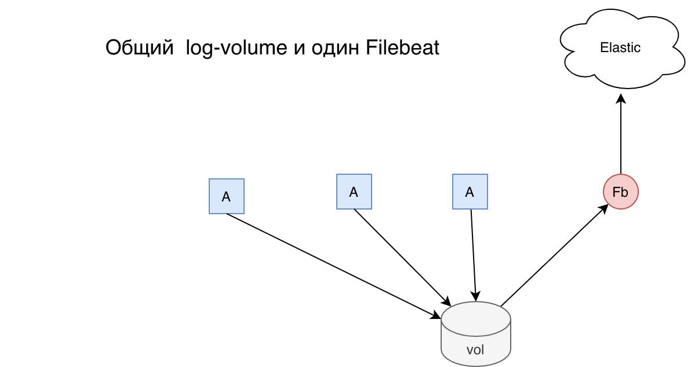

log-watcher
========
следит за новыми файлами логов и посылает новые строки логов в Elasticsearch 

Является частью проекта log-monitor.

Схема приложения
--------------

Приложения пишут логи в общий вольюм. Служба filebeat следит за файлами логов отправляет новые строки в Эластик.

